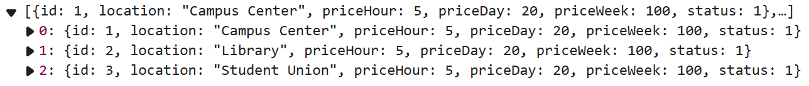

# E-Scooter Rental System

## Project Overview
A web application for renting electric scooters in the City Centre.

## Project Structure

```
.
├── frontend/    # Vue.js frontend project
└── backend/     # Spring Boot backend project
```

## Tech Stack

### Frontend
- Vue.js 3
- Vite
- Vue Router
- Axios

### Backend
- Spring Boot 3.2.2
- Spring Data JPA
- MySQL 8.0
- Maven

## Development Requirements

- Node.js 16+
- JDK 17
- Maven 3.9+
- MySQL 8.0+

## Database Setup

1. Install MySQL 8.0+
2. Create database:
```sql
CREATE DATABASE IF NOT EXISTS vuesb;
```
3. Configure database connection (in `application.properties`):
   - URL: jdbc:mysql://localhost:3306/vuesb
   - Username: root
   - Password: root

## Running the Project

### Backend

```bash
cd backend
mvn spring-boot:run
```

Backend service will run on http://localhost:8080

### Frontend

```bash
cd frontend
npm install
npm run dev
```

Frontend service will run on http://localhost:5173

## API Documentation

### Authentication API

#### User Registration

- **URL**: `/api/auth/register`
- **Method**: `POST`
- **Request Body**:
  ```json
  {
    "username": "string",     // 3-20 characters, letters, numbers and underscore only
    "password": "string",     // Min 8 chars, must contain uppercase, lowercase and number
    "email": "string",        // Valid email format
    "mobile": "string",       // 10-13 digits
    "birthday": "date"        // Format: YYYY-MM-DD, must be in the past
  }
  ```
- **Success Response** (200 OK):
  ```json
  {
    "message": "Registration successful",
    "userId": "number",
    "username": "string"
  }
  ```
- **Error Response** (400 Bad Request):
  ```json
  {
    "username": "error message",
    "password": "error message",
    "email": "error message",
    "mobile": "error message",
    "birthday": "error message"
  }
  ```

#### User Login

- **URL**: `/api/auth/login`
- **Method**: `POST`
- **Request Body**:
  ```json
  {
    "username": "string",
    "password": "string"
  }
  ```
- **Success Response** (200 OK):
  ```json
  {
    "message": "Login successful",
    "userId": "number",
    "username": "string",
    "userType": "number",
    "email": "string"
  }
  ```
- **Error Response** (400 Bad Request):
  ```json
  {
    "message": "error message"  // e.g., "User not found" or "Invalid password"
  }
  ```

### Scooter API

#### Add scooter

- **URL**: `/api/scooters/add`

- **Method**: `POST`

- **Request Body**:

  ```
  {
  location: string,
  priceHour: bigdecimal,
  priceDay: bigdecimal,
  priceWeek: bigdecimal,
  status: int
  }
  ```

- **Success Response** (200 OK):

  ```
  {
      message: "Add successful",
      Scooter ID: int
  }
  ```

  **Error Response** (400 Bad Request):

  ```
  {
    "message": "error message"
  }
  ```

#### view all

**URL**: `/api/scooters/getAll`

**Method**: `Get`

**Success Response** (200 OK):



### Booking API

#### Create Booking

- **URL**: `/api/bookings`
- **Method**: `POST`
- **Request Body**:
  ```json
  {
    "userId": "number",       // User ID
    "scooterId": "number",    // Scooter ID
    "hireType": "string",     // One of: "HOUR", "FOUR_HOURS", "DAY", "WEEK"
    "startTime": "string"     // Format: "YYYY-MM-DD HH:mm:ss"
  }
  ```
- **Success Response** (200 OK):
  ```json
  {
    "message": "Booking successful",
    "orderId": "number",
    "startTime": "datetime",
    "endTime": "datetime",
    "price": "number"
  }
  ```
- **Error Response** (400 Bad Request):
  ```json
  {
    "message": "error message"  // e.g., "User not found", "Scooter not found", 
                               // "Invalid date format", "Booking time cannot be earlier than current time",
                               // "Selected time period is already booked", "Invalid hire type"
  }
  ```

#### Get Booking Timeline

- **URL**: `/api/bookings/timeline/{scooterId}`
- **Method**: `GET`
- **Path Parameters**:
  - `scooterId`: ID of the scooter
- **Success Response** (200 OK):
  ```json
  [
    {
      "startTime": "datetime",
      "endTime": "datetime",
      "status": "string",     // "booked" or "available"
      "hirePeriod": "string"  // Only present when status is "booked"
    }
  ]
  ```
- **Error Response** (400 Bad Request):
  ```json
  {
    "message": "Failed to get timeline: error message"
  }
  ```

### Email Notifications

The system automatically sends email confirmations for successful bookings. The email includes:
- Booking confirmation message
- Order ID
- Location
- Start and end times
- Rental duration
- Rental fee
- Contact information


## Validation Rules

b_user

### Username

- Length: 3-20 characters
- Allowed characters: letters, numbers, underscore
- Special characters not allowed

### Password
- Minimum length: 8 characters
- Must contain:
  - At least one uppercase letter
  - At least one lowercase letter
  - At least one number

### Email
- Must be valid email format
- Cannot be already registered

### Mobile Number
- Length: 10-13 digits
- Numbers only

### Birthday
- Must be valid date format (YYYY-MM-DD)
- Cannot be a future date

### b_scooter table

#### location

#### price per hour/day/week

- Integers have a maximum of three digits, and decimal places have a maximum of two digits